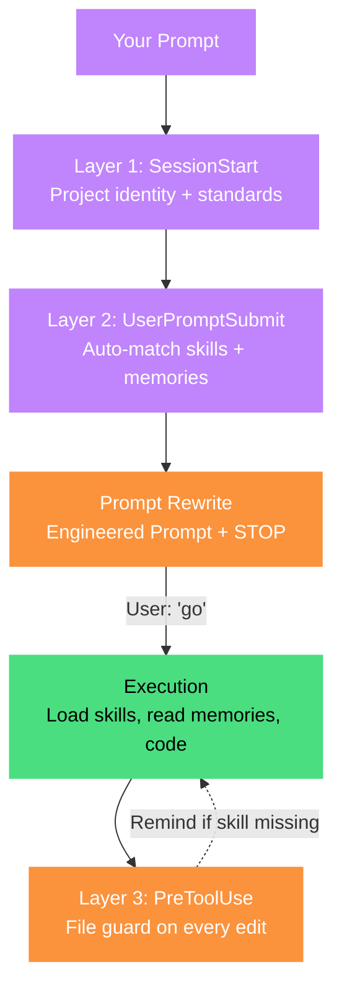
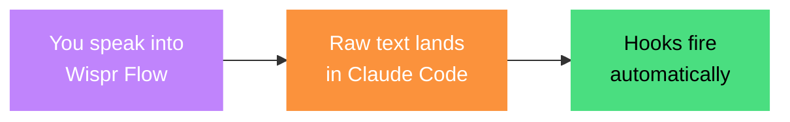
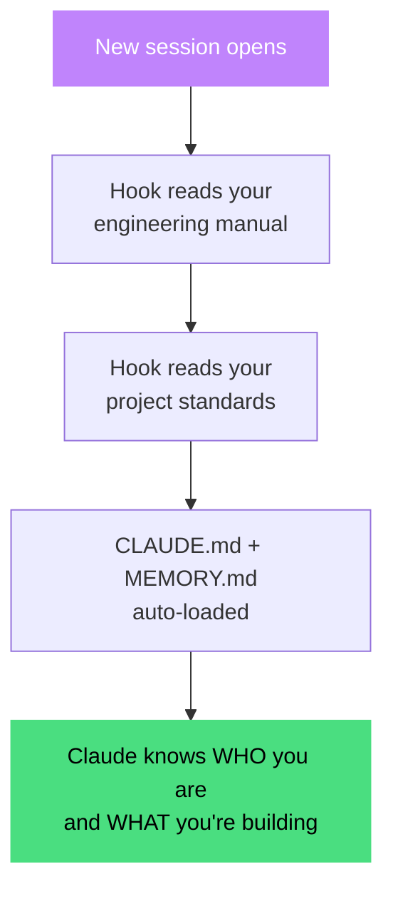
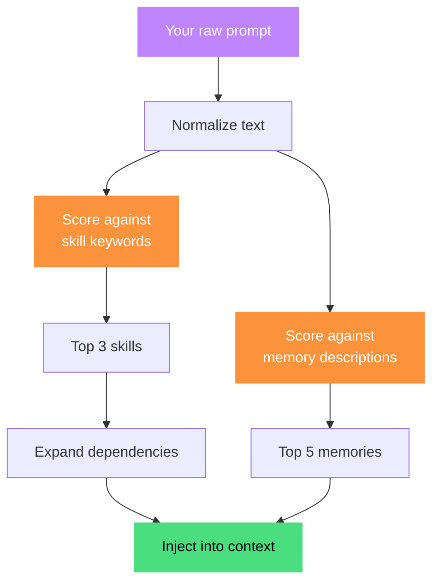
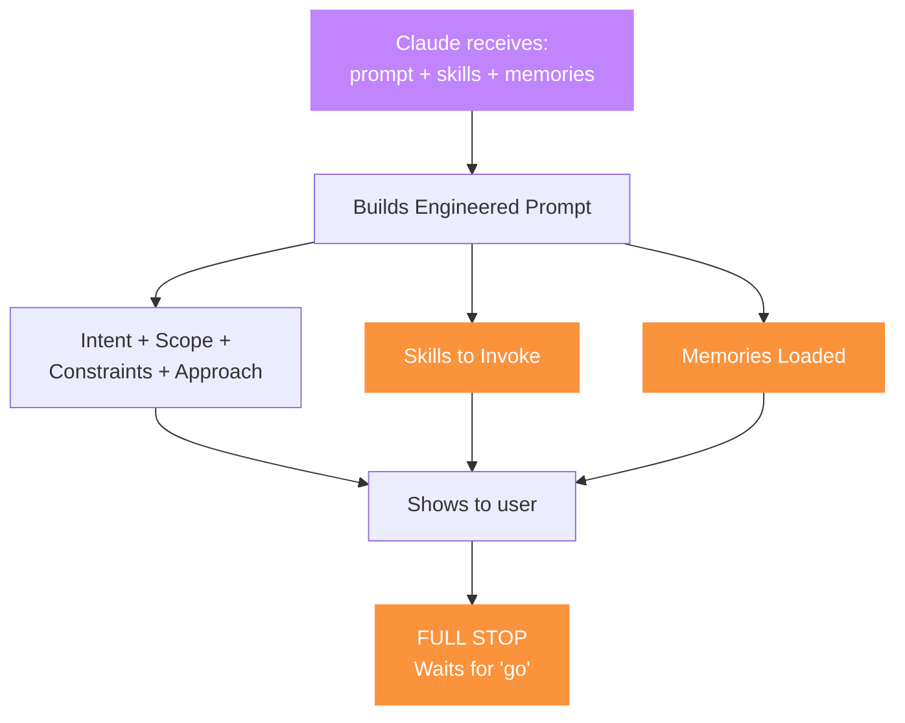
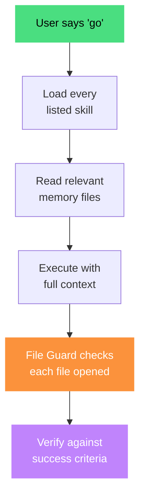
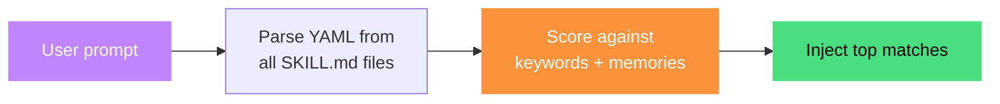
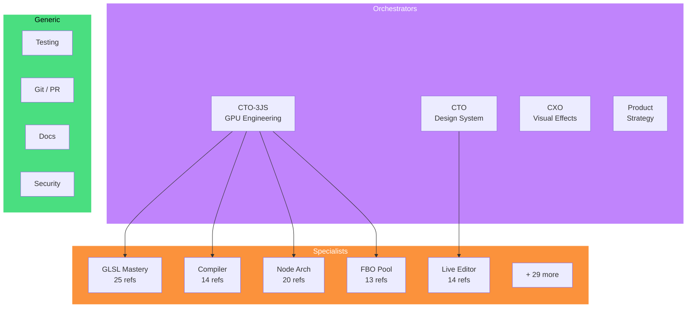
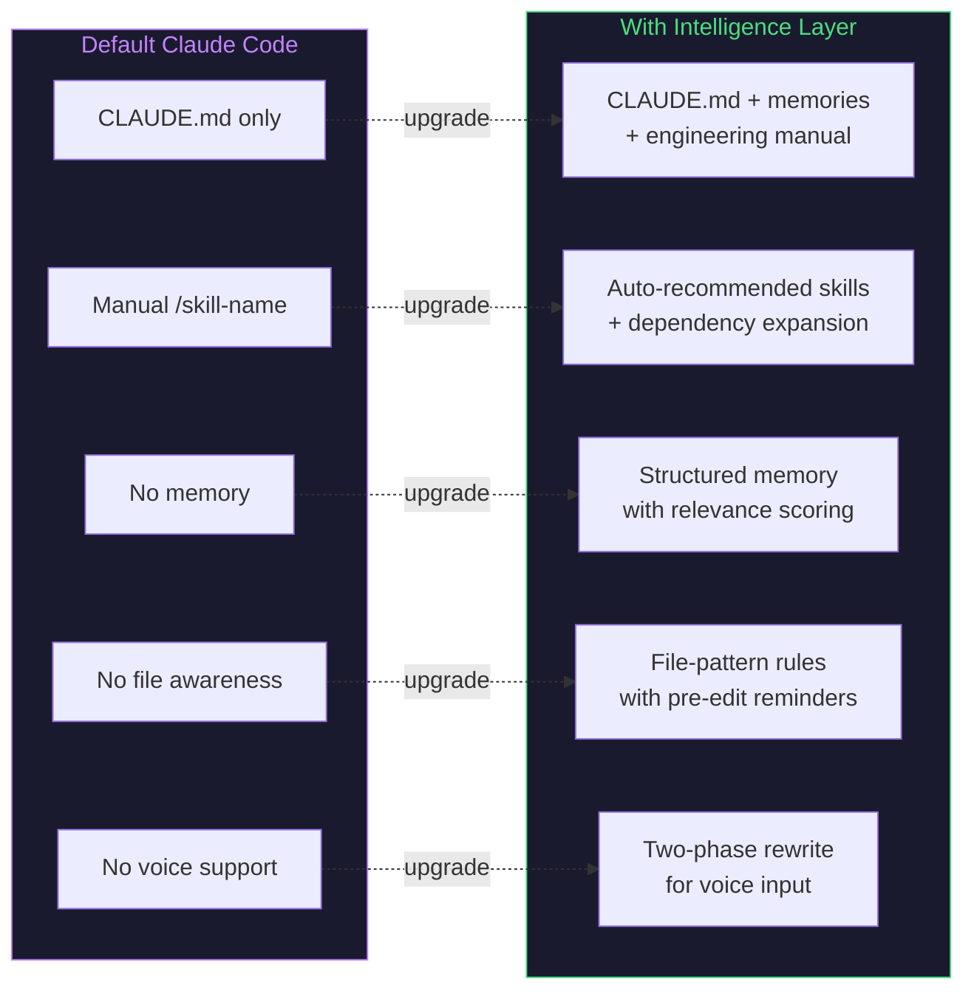

<div align="center">


<br>

# `>_ Claude Context Intelligence Layer`

### Make Claude Code Remember Everything

<br>

**Three hooks. Zero dependencies. Your Claude becomes a senior engineer who's been on your team for months.**

<br>

[](LICENSE)
[](https://claude.ai/code)
[](https://nodejs.org)
[](.)
[](.)

<br>

*If this helps you, hit the star button above. Built by Akshay Hooda and shared with love for the community.*

</div>

---

<br>

## The Problem

You talk to Claude. Claude writes brilliant code. Then you start a new session and Claude has **amnesia**.

It doesn't know your architecture. It doesn't remember the bug you fixed last week. It doesn't know that a specific pattern breaks your pipeline. It doesn't know which technical approaches your team has evaluated and rejected.

**Every session starts from zero.**

And if you use voice-to-text (Wispr Flow, macOS Dictation, Superwhisper), your prompts look like this:

> *"hey so fix that thing where the fractal node warp isn't working the noise base needs more options and add mouse interactivity following our pattern you know the one"*

Claude executes this literally. Wrong assumptions. Wasted rounds. Missed intent.

**This system fixes both problems.**

<br>

---

<br>

## What This Actually Does

```diff
- Claude forgets your project every session
+ Claude loads your project identity, standards, and memory at session start

- You manually type /skill-name to load skills  
+ Skills auto-match against your prompt keywords and get recommended

- Voice prompts execute literally (wrong assumptions)
+ Voice prompts get rewritten into structured execution plans

- Past mistakes get repeated
+ Feedback memories auto-inject on relevant prompts

- Context lost after long conversations
+ Three-layer re-injection survives context compaction

- You edit critical files without project rules loaded
+ File-based dispatch loads the right skills when you touch governed files
```

<br>

---

<br>

## Architecture

> [!IMPORTANT]
> Three independent hooks fire at different times. Each layer is a safety net for the others.

<br>



<br>

---

<br>

## The Complete Pipeline: Voice to Code

> [!TIP]
> Follow the flow from the moment you speak to the moment code is written.

<br>

### Stage 1: What Happens When You Speak



Your voice-to-text app captures natural speech. The raw transcription -- messy, rambling, implicit -- goes straight into the chat. **No cleanup needed.** The hooks handle everything.

<br>

### Stage 2: Session Start (fires once)



<br>

### Stage 3: Prompt Intelligence (fires every prompt)



**How scoring works:**

- **Exact phrase match** in your prompt: `ceil(phrase.length / 4)` points (min 2)
- **Partial word match** (60%+ words found): 1 point
- **Description overlap** (3+ keywords): up to 4 bonus
- **Feedback memories** get +1 priority boost
- **Already-seen skills** get deprioritized

<br>

### Stage 4: The Prompt Rewrite



> [!IMPORTANT]
> Claude does NOT execute during the rewrite phase. No files read, no code written, no tools called. The user reviews the plan, corrects if needed, then confirms.

<br>

### Stage 5: Execution



The **File Guard** (Layer 3) fires before every file read/edit/write. If you open `FbmMaterial.ts`, it checks: "Does the agent have `/glsl-mastery` loaded?" If not, it injects a reminder.

<br>

### The Full Lifecycle

```mermaid
gantt
    title From Voice to Verified Code
    dateFormat X
    axisFormat  
    
    section Input
    Speak into mic           :a, 0, 3
    Text lands in chat       :b, 3, 4
    
    section Hooks
    Scan skills + memories   :c, 4, 6
    Inject matches           :d, 6, 7
    
    section Phase 1
    Build Engineered Prompt  :e, 7, 11
    User reviews + confirms  :crit, f, 11, 14
    
    section Phase 2
    Load skills              :g, 14, 16
    Read memories            :h, 16, 17
    Write code               :i, 17, 24
    File guards fire         :j, 17, 18
    Verify                   :k, 24, 27
```



<br>

---

<br>

## The Magic: Voice to Execution

> [!TIP]
> This is the killer feature. You speak naturally. Claude restructures everything before touching code.

<br>

> [!NOTE]
> The examples below are from a real production project (WebGL shader engine). Your skills and memories will be completely different — API design, auth patterns, database conventions, whatever YOUR project needs. The system adapts to any domain.

### What you say (raw voice-to-text):

> *"hey so I want to fix that thing where the fractal distort node has like the multi-type warp and it's not working properly the noise base needs to be changed and also add mouse interactivity to it following our interactivity state machine pattern you know the one we documented"*

<br>

### What the hook auto-injects (Layer 2):

```
[context-intelligence] Prompt analysis complete.

Skills matched (MUST invoke via Skill tool during execution):
  - /og-node-architecture (score: 19, matched: "new node", "OG node", "combinatorial")
  Co-dependencies: /glsl-mastery, /cto-3js

Relevant memories (read before executing):
  - feedback_interactivity_state_machine.md [FEEDBACK]
  - feedback_shader_conventions.md [FEEDBACK]
  - rare_og_nodes_creation_philosophy.md [PROJECT]
```

<br>

### What Claude outputs (Engineered Prompt):

```yaml
Intent:       Fix FbmMaterial.ts noise base dispatcher + add mouse interactivity
Scope:        lib/r3f-compositor/materials/FbmMaterial.ts + definition file
Context:      Fractal Distort V2 shipped on Apr 7, has 6 fractal types + 5 noise bases
Constraints:  - PCG hash only, never sin(dot())
              - Clamp UV boundaries, never mirror
              - Must include interactivity section per state machine pattern
Skills:       /og-node-architecture + /glsl-mastery + /cto-3js
Memories:     feedback_shader_conventions, feedback_interactivity_state_machine

Awaiting confirmation, Captain
```

<br>

### You say: `"go"`

Claude loads the skills. Reads the memories. Executes with the full institutional knowledge of your project.

**No context lost. No lessons forgotten. No skills skipped.**

<br>

---

<br>

## The Three Layers Explained

<br>

### Layer 1: SessionStart -- Identity

> Fires **once** when a new session begins.

Injects your project's engineering manual, standards, and the memory index. Claude knows who you are and what you're building before you type a word.

**Hook:** `inject-context.mjs` (not included -- simple `readFileSync` + output as `additionalContext`)

<br>

### Layer 2: UserPromptSubmit -- Intelligence

> Fires on **every single prompt**, before Claude sees it.



**Scoring algorithm:**

- Exact phrase match: `ceil(phrase.length / 4)` points (minimum 2)
- Partial word match (60%+ of phrase words found): 1 point
- Description keyword overlap (3+ words): up to 4 bonus points
- Feedback memories get +1 priority boost
- Project memories get +0.5 priority boost
- Skills already seen this session get deprioritized

**Hook:** [`hooks/prompt-intelligence.mjs`](hooks/prompt-intelligence.mjs)

<br>

### Layer 3: PreToolUse -- File Guard

> Fires **before every file read/edit/write**.

Checks the file path against a static map of pattern-to-skill rules. If you open a shader file without loading `/glsl-mastery`, this layer catches it.

```
[context-intelligence] File "materials/FbmMaterial.ts" matches skills:
/og-node-architecture, /glsl-mastery. Invoke before making changes.
```

**Hook:** [`hooks/file-dispatch.mjs`](hooks/file-dispatch.mjs)

<br>

---

<br>

## Skill System: The Cognitive Mesh

> [!NOTE]
> Skills are NOT documentation files. They are **specialist brains** -- each with decision trees, non-negotiables, anti-patterns, and deep reference documents.

<br>



<br>

### Skill File Structure

```
my-skill/
  SKILL.md                    # The Expert Brain
    YAML Frontmatter            - promptSignals, pathPatterns, priority
    Domain Identity             - what this covers + boundaries
    Decision Tree               - "given X, read reference Y"
    Non-Negotiables             - quality rules (violations = amateur)
    Anti-Patterns               - common mistakes with corrections
  references/
    patterns.md                 # 800-2000 lines of deep, actionable content
    architecture.md             # Project-specific implementation details
    case-studies.md             # Analyzed real implementations
```

### YAML Frontmatter (The Auto-Injection Key)

```yaml
---
name: my-api-skill
description: API design patterns, REST conventions, error handling...
metadata:
  priority: 80
  pathPatterns:
    - '**/api/**'
    - '**/routes/**'
  promptSignals:
    phrases:
      - 'API endpoint'
      - 'route handler'
      - 'REST API'
      - 'authentication'
      - '500 error'
    minScore: 4
---
```

The hook reads this from every skill and scores your prompt against the phrases. If the score meets `minScore`, the skill is auto-recommended. No manual `/skill-name` needed.

> **Deep dive:** See [`examples/COGNITIVE-MESH-ARCHITECTURE.md`](examples/COGNITIVE-MESH-ARCHITECTURE.md) for the full guide on structuring specialists, orchestrators, routing tables, and scaling from 5 skills to 50+.

<br>

---

<br>

## Memory System: Claude Remembers

<br>

> [!IMPORTANT]
> Memories persist across conversations. When Claude learns something new -- a correction, a decision, a user preference -- it writes a memory file. Future sessions have access to ALL previously stored knowledge.

<br>

### Four Memory Types

| Type | Priority | Purpose | Example |
|:---|:---:|:---|:---|
| **Feedback** | Highest (+1 boost) | Rules from past mistakes | *"Never use mirror UV wrapping -- creates seams"* |
| **Project** | High (+0.5 boost) | Current state & decisions | *"V3 compiler is production, V4 quarantined"* |
| **User** | Standard | Profile & preferences | *"Uses voice-to-text, prefers concise responses"* |
| **Reference** | Standard | External system pointers | *"Bugs tracked in Linear project INGEST"* |

### Memory File Format

```markdown
---
name: feedback_auth_fix
description: Auth tokens must be validated server-side, not in middleware
type: feedback
---

# The Rule

Validate auth tokens in the route handler, not middleware.

**Why:** Middleware validation caused a race condition on 2026-03-15.
Three hours to debug. The token refresh happened after middleware
but before the handler, causing intermittent 401s.

**How to apply:** Any code touching auth flow must validate in
the handler. Check for this pattern in code review.
```

<br>

---

<br>

## Quick Start

<br>

### 1. Copy the hooks

```bash
mkdir -p ~/.claude/hooks/intelligence
cp hooks/prompt-intelligence.mjs ~/.claude/hooks/intelligence/
cp hooks/file-dispatch.mjs ~/.claude/hooks/intelligence/
```

### 2. Register in `~/.claude/settings.json`

```jsonc
{
  "hooks": {
    "UserPromptSubmit": [
      {
        "matcher": "",
        "hooks": [{
          "type": "command",
          "command": "node \"$HOME/.claude/hooks/intelligence/prompt-intelligence.mjs\"",
          "timeout": 8
        }]
      }
    ],
    "PreToolUse": [
      {
        "matcher": "Read|Edit|Write",
        "hooks": [{
          "type": "command",
          "command": "node \"$HOME/.claude/hooks/intelligence/file-dispatch.mjs\"",
          "timeout": 5
        }]
      }
    ]
  }
}
```

### 3. Create your first skill

```bash
mkdir -p .claude/skills/my-skill/references
```

> See [`examples/SKILL-TEMPLATE.md`](examples/SKILL-TEMPLATE.md) for the complete template.

### 4. Create your first memory

> See [`examples/MEMORY-TEMPLATE.md`](examples/MEMORY-TEMPLATE.md) for the complete template.

### 5. Add Prompt Rewrite Protocol to CLAUDE.md

> See [`examples/PROMPT-REWRITE-PROTOCOL.md`](examples/PROMPT-REWRITE-PROTOCOL.md) for copy-paste instructions.

### 6. Test it

```bash
echo '{"prompt":"build a new API with auth","session_id":"test","cwd":"."}' \
  | node ~/.claude/hooks/intelligence/prompt-intelligence.mjs
```

<br>

---

<br>

## Customize for Your Project

<br>

### `prompt-intelligence.mjs`

| Config | Default | What it does |
|:---|:---:|:---|
| `MAX_SKILLS_INJECTED` | 3 | Max skills recommended per prompt |
| `MAX_MEMORIES_INJECTED` | 5 | Max memories surfaced per prompt |
| `DEFAULT_MIN_SCORE` | 4 | Keyword match threshold |
| `MEMORY_MATCH_THRESHOLD` | 2 | Memory relevance threshold |
| `SKILL_DEPENDENCIES` | `{}` | Skill co-dependency graph |
| `isTargetProject()` | checks for `.claude/skills/` | Project detection logic |

### `file-dispatch.mjs`

| Config | What to customize |
|:---|:---|
| `FILE_SKILL_MAP` | Array of `{ pattern: /regex/, skills: ['/name'] }` rules |
| `isTargetProject()` | Project detection logic |

<br>

---

<br>

## Why This Beats the Default

<br>



<br>

---

<br>

## Repo Structure

```
claude-context-intelligence-layer/
  hooks/
    prompt-intelligence.mjs     # UserPromptSubmit hook (the brain)
    file-dispatch.mjs           # PreToolUse hook (the file guard)
  examples/
    SKILL-TEMPLATE.md               # Copy-paste skill starter
    MEMORY-TEMPLATE.md              # Copy-paste memory starter
    CLAUDE-MD-SKILL-SECTION.md      # Skill mapping tables for CLAUDE.md
    PROMPT-REWRITE-PROTOCOL.md      # The two-phase rewrite protocol
    COGNITIVE-MESH-ARCHITECTURE.md  # Full guide to structuring skills at scale
  README.md                     # You are here
  LICENSE                       # MIT
```

<br>

---

<br>

## FAQ

<br>

**Does this slow down Claude Code?**
<br>The hooks have 5-8 second timeouts. In practice, scanning skills + memories takes <500ms. You won't notice it.

<br>

**What happens after context compaction?**
<br>Layer 2 re-injects skill and memory matches on EVERY prompt. Even after compaction, the next prompt gets fresh recommendations.

<br>

**How many skills should I create?**
<br>Start with 3-5 for your core domains. The system scales to any number — we've tested with 47 and zero performance issues. Your project might need 5 or 50.

<br>

**Do I need voice-to-text?**
<br>No. The system works with typed prompts too. Voice input is where it shines brightest because that's where the context gap is largest.

<br>

**Can I use this with Cursor?**
<br>The hook protocol is compatible. See the hook scripts for platform detection logic.

<br>

---

<br>

<div align="center">

### Your Claude is already smart. This makes it smart about *your* project.

<br>

**[Get Started](#quick-start)** | **[Read the Docs](examples/)**

<br>

*If this helps you, star the repo. Built by Akshay Hooda. Every rule in this system was learned from a real failure.*

</div>
